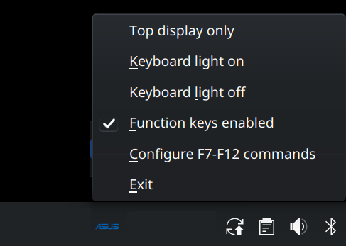

# ASUS Zenbook Duo helpers

Small quality-of-life tools for the ASUS Zenbook Duo (2024, UX8406) on Linux.

This package is for the moments when you take the keyboard off and want the laptop to behave like the dual-screen machine it is meant to be. Some of the functionalities are based on [this repo](https://github.com/alesya-h/zenbook-duo-2024-ux8406ma-linux).

## What it does

- **Keyboard removed:** turns on both built-in displays.
- **Keyboard attached:** turns off the lower display, leaving the main screen active.
- **Keyboard backlight:** adds a small tray-menu control for turning the keyboard light on or off.
- **Function keys:** makes the detachable keyboard's mute, volume, keyboard-light, and screen-brightness keys work.
- **External monitor and closed lid:** turns off the laptop's built-in displays while you use the external monitor, then turns them back on when you open the lid or disconnect the monitor.

It works with both KDE Plasma and GNOME. KDE Plasma is the better-supported experience at the moment.

## Install

Download or build the `.deb` package, then open it with your usual software installer, or install it from a terminal:

```bash
sudo apt install ./asus-duo-tools_1.4_all.deb
```

Log out and back in after installing so the tray menu and display helper can start with your desktop session.

### Enable keyboard and function-key controls

To let your account control the keyboard backlight and function keys without entering your password each time, run:

```bash
sudo usermod -aG dialout,input $USER
```

Then log out and back in once more.

## GNOME note

GNOME already manages the built-in displays when the lid is closed, so its extra lid-monitor helper should be disabled to avoid overlapping behavior:

```bash
sudo rm /etc/xdg/autostart/lid-monitor.desktop
```

The lid-monitor helper is mainly intended for KDE Plasma.

## Included controls

After signing in, look for the ASUS icon in the system tray. Its menu can switch to the top display only and turn the keyboard backlight on or off.



The keyboard's top-row keys also work while it is attached: mute, volume down/up, keyboard-light cycle, and screen-brightness down/up. Use the tray menu to enable or disable this helper.

### Assign commands to F7–F12

Choose **Configure F7-F12 commands** from the tray menu to open a small settings window. Enter a command beside any key, such as `duo toggle` for F7, then choose **Save**. Leave a field blank to keep its usual F-key behavior. Changes take effect the next time the key is pressed.

Whether function keys are enabled is saved automatically, so the tray app restores that choice after a reboot.

If something does not behave as expected, logging out and back in is a good first reset after connecting or disconnecting the keyboard or an external monitor.
